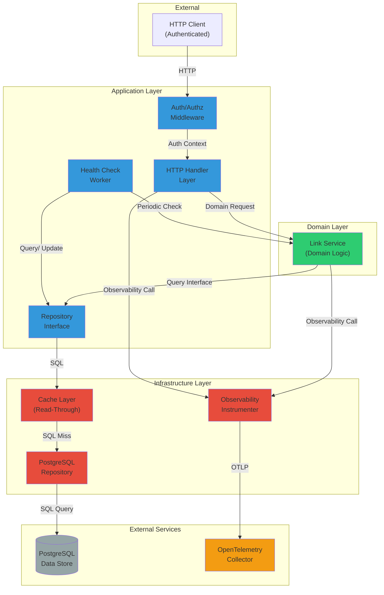

# SAD — Internal Link Shortener

## 0. Document Control

| Field | Value |
|-------|-------|
| System Name | Internal Link Shortener |
| SAD ID | SAD-THROWAWAY-INITIATIVE-001 |
| Author | Architecture Generation System |
| Date | 2026-07-14 |
| Status | Draft |
| Governance Model Version | 1.0 |
| Spec Version | v1.1 |
| Upstream Artifacts | PRD-THROWAWAY-INITIATIVE-001 (Frozen), ACF-THROWAWAY-INITIATIVE-001 (Frozen) |
| Related ADRs | None at generation time |

---

## 1. Intent Summary

The Internal Link Shortener solves the problem of link rot and organizational friction when internal teams share long, unstable URLs across chat and documentation. The system must:

- Enable authenticated users to mint short, stable links for any internal URL in under five seconds (R-1, PRD §5)
- Allow link owners to update a link's target without changing the short link itself (R-3, PRD §5)
- Report, per link, whether the target currently resolves (R-5, PRD §5)
- Record a resolve count per short link (R-4, PRD §5)
- Enforce ownership: only the link owner or a platform admin can update or delete a link (R-6, PRD §5)

The architecture must respect the following non-goals and constraints from the PRD:

- No public or anonymous link shortening; internal, authenticated use only (PRD §4)
- No click analytics beyond a resolve count; no per-user tracking (PRD §4)
- No custom vanity domains (PRD §4)

The architecture must comply with ACF guardrails:

- Onion architecture: domain logic depends on nothing outward; adapters depend inward
- Stateless services: all state lives in PostgreSQL, never in process memory
- PostgreSQL is the only permitted persistent store
- Synchronous request path: the redirect (resolve) path must not depend on queues or asynchronous hops

---

## 2. Scope and Non-Goals (Hard Boundary)

### In Scope

- **Link creation service:** authenticated users submit a target URL and receive a short link in under five seconds
- **Link resolution service:** a short link (e.g., `https://svc.internal/go/abc123`) resolves via HTTP redirect to its current target URL
- **Link update service:** the link owner can update the target URL without changing the short link
- **Ownership and authorization:** only the link owner or a platform admin can update or delete a link; enforcement via the existing SSO provider
- **Resolve counting:** the system records, per link, the number of times it has been resolved
- **Health checking:** a background worker periodically checks whether each link's target currently resolves and records the result
- **Data persistence:** PostgreSQL is the authoritative store for links, owners, resolve counts, and target health status

### Explicit Non-Goals

- **Public or anonymous link shortening:** this system is for internal, authenticated users only (PRD §4)
- **Per-user click analytics:** no tracking of which user resolved which link; only aggregate resolve counts per link (PRD §4)
- **Custom vanity domains:** short links are auto-generated; no support for user-chosen short names (PRD §4)
- **Introducing new persistent stores:** PostgreSQL is the only datastore; no second database technology (ACF §1)
- **Asynchronous redirect path:** link resolution must be synchronous; no queues in the redirect critical path (ACF §1)
- **In-process mutable state:** all state is external to the service; no shared mutable state in process memory (ACF §1)

### Out of Scope

Anything not listed above is out of scope. Notably:

- Custom DNS or domain management (links are served from a fixed internal domain)
- Advanced caching strategies beyond read-through cache for the resolve path
- Multi-region replication or disaster recovery (platform responsibility)
- Alternative link generation strategies (e.g., custom short names, collision handling via user input) — generation is deterministic

---

## 3. System Context (Black Box)

### Responsibilities

The Internal Link Shortener is a single, deployable service that accepts requests from authenticated internal users and systems, and provides:

1. **Link creation:** accept a target URL and authentication context; return a short link
2. **Link resolution:** accept a short link code; return a redirect to the current target or a 404 if the link does not exist
3. **Link management:** allow owners to update or delete their links
4. **Health status:** report the current resolve status of a link's target

### External Actors / Systems

| Actor / System | Interaction Type | Purpose |
|---|---|---|
| **Internal users** (via HTTP client or browser) | Sync HTTP | Create links; resolve links by following redirects |
| **Existing SSO provider** | Sync HTTP (identity assertion) | Authenticate every request; provide user identity and authorization context |
| **PostgreSQL** | Sync database queries (TCP/IP) | Store links, owners, resolve counts, target health status |
| **OpenTelemetry collector** | Async OTLP (gRPC or HTTP) | Receive traces and metrics for observability |
| **Background worker** (same codebase, separate deployment) | Timer-driven process | Periodically check target health; write results to PostgreSQL |

### Trust Boundaries

**Trust boundary 1: Unauthenticated → Authenticated**

- **Crossing:** HTTP ingress to the service
- **Mechanism:** All inbound HTTP requests are intercepted by the SSO provider; no request reaches the service without a valid identity assertion in the request context
- **Contract:** Every request includes an `Authorization` header (or equivalent) validated by the platform's SSO integration; the service consumes the authenticated identity and performs authorization decisions (link ownership checks) based on the provided identity

**Trust boundary 2: Application → PostgreSQL**

- **Crossing:** Direct database queries over TCP/IP
- **Mechanism:** PostgreSQL connection pooling with credentials managed by the Kubernetes platform (mounted as environment variables, never in code or images)
- **Contract:** The connection is authenticated to PostgreSQL; the service has restricted permissions (no administrative access)

### Diagrams

```mermaid
graph TB
    subgraph "External"
        USER["Internal Users<br/>(Browser/Client)"]
        SSO["SSO Provider<br/>(Identity)"]
        OTEL["OpenTelemetry<br/>Collector"]
    end
    
    subgraph "Internal Link Shortener System"
        SERVICE["Link Shortener Service"]
    end
    
    subgraph "Persistent Store"
        PG["PostgreSQL<br/>(Links, Owners, Counts)"]
    end
    
    USER -->|HTTP (Authenticated)| SERVICE
    SERVICE -->|Redirect HTTP| USER
    SSO -->|Identity Assertion| SERVICE
    SERVICE -->|SQL Queries| PG
    SERVICE -->|OTLP Traces/Metrics| OTEL
    
    style SERVICE fill:#4a90e2
    style PG fill:#7a5c8f
    style SSO fill:#f5a623
    style OTEL fill:#f5a623
```

---

## 4. High-Level Architecture (White Box)

### Major Components

The system is decomposed into the following major components:

#### 1. **HTTP Handler Layer**

- **Responsibility:** Accept inbound HTTP requests; dispatch to appropriate business logic; return HTTP responses
- **Scope:** Handles routes for link creation, resolution, update, deletion, and health status retrieval
- **Key interactions:** Receives authenticated requests from external users; delegates to service layer; returns HTTP responses; emits observability signals

#### 2. **Link Service (Domain Logic)**

- **Responsibility:** Encapsulate the business logic for link operations: creation, resolution, update, deletion, ownership verification
- **Scope:** Determines whether a link creation request is valid; generates short codes; verifies ownership before allowing updates or deletion; determines the current target for a link
- **Key interactions:** Receives requests from HTTP Handler; delegates persistence to Repository; emits domain events or logging for observability

#### 3. **Repository (Persistence Abstraction)**

- **Responsibility:** Abstract the details of PostgreSQL interaction; provide a clean, testable interface for reading and writing link data
- **Scope:** Query construction and execution; transaction management; result mapping from PostgreSQL rows to domain objects
- **Key interactions:** Receives queries from Link Service; executes SQL against PostgreSQL; returns domain objects or signals (not found, integrity violation, etc.)

#### 4. **Cache Layer (Optional Read-Through)**

- **Responsibility:** Reduce database load on the resolve path by caching the mapping from short code to current target
- **Scope:** Per-link caching; cache invalidation on link update; graceful fallback if cache is unavailable
- **Key interactions:** Receives resolve queries; returns cached target if present and valid; otherwise delegates to Repository; writes result back to cache
- **Constraint:** Cache miss must still resolve correctly against PostgreSQL; cache is strictly read-through, not authoritative

#### 5. **Health Check Worker (Background Process)**

- **Responsibility:** Periodically verify that each link's target URL still resolves; record the result
- **Scope:** Timer-driven loop (outside request path); HTTP-check each link target; record success/failure and timestamp in PostgreSQL
- **Key interactions:** Wakes on a timer; queries PostgreSQL for all links; attempts HTTP HEAD/GET against each target; writes health status back to PostgreSQL
- **Constraint:** This component is isolated from the critical request path (R-2 latency must be unaffected)

#### 6. **Observability Instrumenter**

- **Responsibility:** Emit traces, metrics, and structured logs for operational visibility
- **Scope:** Instrument HTTP handlers, service layer, and repository for latency, error rates, and business metrics (links created, resolved, updated)
- **Key interactions:** Called from within HTTP handlers and services; sends OTLP payloads to the platform's OpenTelemetry collector
- **Constraint:** Instrumentation is non-blocking and does not impact critical path latency

#### 7. **Authentication/Authorization Middleware**

- **Responsibility:** Verify that the request is authenticated; extract and validate the identity; enforce ownership checks for mutating operations
- **Scope:** Intercepts HTTP requests; validates the identity assertion from SSO; stores the identity in request context; provides identity to Link Service for ownership checks
- **Key interactions:** Runs before HTTP Handler; receives identity from SSO context; makes available to service layer for authorization decisions
- **Note:** Actual authentication is delegated to platform SSO; this component consumes the result

### Layer Assignment

**Dependency Direction Rule:** Source code dependencies point inward only. Infrastructure → Application → Domain. Domain depends on nothing external (ACF §1).

| Component | Layer | Justification |
|-----------|-------|---------------|
| **Link Service** | Domain | Encapsulates core business logic for link creation, resolution, updates, and ownership. Depends on no external framework or library. Interfaces with abstractions (Repository) defined in Application layer. |
| **HTTP Handler Layer** | Application | Defines HTTP contracts and orchestrates request flow. Depends on Link Service (inward). Translates HTTP requests/responses to/from domain language. |
| **Repository** | Application | Defines the interface for persistence (abstracting PostgreSQL). Implementations depend inward; callers (Link Service and HTTP Handlers) depend on the interface. |
| **Cache Layer** | Infrastructure | Read-through cache implementation. Depends on Repository and concrete persistence details. Callers depend on the Cache through the Repository interface (or a wrapper abstraction). |
| **Health Check Worker** | Application | Background job orchestration. Depends on Link Service and Repository for data access. Does not import framework types directly into domain. |
| **Observability Instrumenter** | Infrastructure | Emits traces/metrics to external collector. Depends on no domain logic. Instrumentation is applied via middleware or wrapper patterns. |
| **Authentication/Authorization Middleware** | Application | Consumes identity from platform SSO; enforces ownership checks (via context passed to Link Service). Does not import domain logic directly; provides identity context to downstream layers. |

### Communication Patterns

- **Synchronous HTTP:** HTTP handlers expose REST or similar interface for link creation, resolution, update, deletion, and health status retrieval
- **Synchronous SQL:** Repository executes SQL queries and awaits results (standard connection pooling)
- **Asynchronous observability:** OTLP traces and metrics are sent asynchronously to the platform collector (non-blocking fire-and-forget within request context)
- **No message broker:** Per ACF §1, no queue in the critical path; health checking is a separate background process
- **No in-process state:** All state is persisted to PostgreSQL; service instances are stateless and interchangeable

### Diagrams



**Data Flow Diagram:**

```mermaid
graph LR
    USER["User Request"]
    
    USER -->|1. POST /api/links<br/>{ target_url }| HTTP["HTTP Handler"]
    HTTP -->|2. CreateLink(target, user_id)| LINK_SVC["Link Service"]
    LINK_SVC -->|3. Insert Link Record<br/>{ short_code, target, owner_id, timestamp, resolve_count: 0, health_status: null }| REPO["Repository"]
    REPO -->|4. SQL INSERT| PG["PostgreSQL<br/>links table"]
    PG -->|5. Row inserted| REPO
    REPO -->|6. Link(short_code, ...)| LINK_SVC
    LINK_SVC -->|7. { short_code, ... }| HTTP
    HTTP -->|8. 201 { short_link_url }| USER
    
    USER2["User Request 2"]
    USER2 -->|1. GET /go/{short_code}| HTTP2["HTTP Handler"]
    HTTP2 -->|2. Resolve(short_code)| CACHE["Cache Layer"]
    CACHE -->|3. Cache Miss| REPO2["Repository"]
    REPO2 -->|4. SELECT target, owner FROM links WHERE short_code = ?| PG
    PG -->|5. Returns target | REPO2
    REPO2 -->|6. target_url| CACHE
    CACHE -->|7. target_url + cache write| HTTP2
    HTTP2 -->|8. Increment resolve_count| REPO3["Repository"]
    REPO3 -->|9. UPDATE links SET resolve_count = resolve_count + 1| PG
    HTTP2 -->|10. 302 Redirect| USER2
    
    style LINK_SVC fill:#2ecc71
    style HTTP fill:#3498db
    style HTTP2 fill:#3498db
    style REPO fill:#3498db
    style REPO2 fill:#3498db
    style REPO3 fill:#3498db
    style CACHE fill:#e74c3c
    style PG fill:#95a5a6
```

---

## 5. Key Architectural Decisions

### Decision 1: Synchronous Redirect Path (No Asynchronous Hops)

**Decision:** The link resolution (redirect) request must execute synchronously; all data reads and writes needed to complete a redirect must be in-request, not queued.

**Rationale:**
- PRD §7 (Success Measures) requires redirect latency under 100ms at the 95th percentile
- Queuing (message broker, job system) adds unpredictable latency and introduces operational complexity
- ACF §1 mandates: "The redirect path must not depend on a queue or any asynchronous hop"
- Synchronous SQL queries are predictable and testable

**Alternatives Considered:**
1. Asynchronous event-driven resolve: emit a "link resolved" event to a queue; record the count later
   - **Rejected:** Violates ACF §1; introduce message broker (prohibited); adds latency; decouples count from actual resolve

**Consequences:**
- Redirect latency depends on database latency; must monitor and maintain (PostgreSQL and network latency are the critical path)
- Resolve count is synchronously written; guaranteed consistency
- Horizontally scaling the service requires only stateless HTTP instances and a connection pool to PostgreSQL

---

### Decision 2: Read-Through Cache for Short Code Lookup

**Decision:** Implement a read-through cache (in-process or local cache) for the mapping from short code to target URL, with write-invalidation on link update.

**Rationale:**
- Resolve path dominates traffic (users click links far more often than they create them)
- Cache miss must still resolve correctly against PostgreSQL (ACF §2: "provided a cache miss still resolves correctly")
- Reduces database load for high-traffic links
- Cache miss fallback ensures safety: if cache is unavailable or stale, resolve still works

**Alternatives Considered:**
1. No cache; every resolve hits PostgreSQL
   - **Rejected:** May overload PostgreSQL for popular links; PRD success measure (100ms at p95) may not be achievable at scale without caching

2. Distributed cache (Redis)
   - **Rejected:** Adds operational complexity; ACF §1 mandates "one datastore" (PostgreSQL only)

**Consequences:**
- Must implement cache invalidation on link update; incorrect invalidation breaks future resolves
- In-process cache limits memory; must set a ceiling and use LRU eviction
- Cache is not a guarantee of correctness; application logic must handle cache misses

---

### Decision 3: Health Checking as Isolated Background Worker

**Decision:** Health checking (verifying whether a link's target still resolves) is a separate, timer-driven background process, not part of the request path.

**Rationale:**
- Health checking is I/O-bound (HTTP requests to external targets, which may be slow or unresponsive)
- Must not add latency to redirect path (PRD R-2, R-5 are distinct requirements)
- ACF §2 permits "Background workers for periodic target-health checks, isolated from the redirect path"
- Decouples the frequency of health checks from user request rate

**Alternatives Considered:**
1. Check health on-demand during resolve
   - **Rejected:** Adds latency to redirect path; if target is slow/unresponsive, redirect is slow

2. Asynchronous health check triggered by resolve
   - **Rejected:** Same isolation benefit, but introduces queue complexity (prohibited by ACF); synchronous worker is simpler

**Consequences:**
- Health status is eventually consistent (lag between actual target state and recorded status)
- Health check results are recorded to PostgreSQL; they are observable to the user but not guaranteed current
- Worker must be deployed as a separate Kubernetes pod or sidecar to avoid blocking the request-handling service

---

### Decision 4: Onion Architecture with Explicit Repository Interface

**Decision:** Implement the repository pattern with an explicit, interface-based abstraction; domain logic (Link Service) depends only on the interface, not on PostgreSQL driver or ORM details.

**Rationale:**
- ACF §1: "Domain logic depends on nothing outward. Adapters (HTTP, persistence) depend inward."
- Enables testability: Link Service can be tested with a mock Repository
- Allows infrastructure changes (e.g., cache wrapping) without changing domain logic
- Clear separation of concerns: Link Service is agnostic to database technology

**Alternatives Considered:**
1. Direct SQL in HTTP handlers
   - **Rejected:** ACF §3 prohibits "Direct SQL in HTTP handlers"; violates onion architecture

2. ORM with eager-loaded domain entities
   - **Rejected:** While cleaner, still couples domain to persistence mechanism; interface is clearer

**Consequences:**
- Repository interface must be comprehensive enough to support Link Service needs
- Multiple Repository implementations (production PostgreSQL, in-memory for tests) must be maintained

---

### Decision 5: Stateless Service Instances (All State in PostgreSQL)

**Decision:** Service instances do not hold mutable in-process state. All state is persisted to PostgreSQL. Service instances are fully interchangeable; any request can be routed to any instance.

**Rationale:**
- ACF §1: "Stateless services. All service instances are interchangeable. Any state lives in the datastore, never in process memory."
- Enables horizontal scaling and rolling restarts without coordination
- Simplifies Kubernetes deployments (no affinity, no rebalancing)
- Cache is explicitly allowed (ACF §2) but is not a source of truth; it is a performance optimization

**Alternatives Considered:**
1. In-process state (e.g., a map of short codes to targets)
   - **Rejected:** Violates ACF §1; breaks horizontal scaling; requires state synchronization between instances

**Consequences:**
- Cache (if implemented) must be local to each instance; each instance has an independent cache
- If cache becomes inconsistent, cache miss forces correct result from PostgreSQL
- Configuration and secrets must arrive via environment variables (Kubernetes ConfigMap/Secret), not instance state

---

## 6. Cross-Cutting Concerns (Architectural Handling)

### Security

**Authentication and Authorization Posture:**

- **Authentication:** All inbound HTTP requests are authenticated by the platform's existing SSO provider (e.g., OAuth 2.0, SAML, or equivalent). No request reaches the service without a valid identity assertion. The service consumes the authenticated identity from the request context (e.g., a header, claim, or middleware-provided attribute).

- **Authorization:** The service enforces ownership-based access control. Only the link owner (the user who created the link) or a platform admin can update or delete a link. Authorization checks occur in the Link Service, which receives the user identity from the HTTP Handler (which receives it from middleware).

- **Trust Boundary:** The boundary between unauthenticated internet and authenticated service is enforced by the SSO provider, not by the service itself. The service assumes every request it receives has already been authenticated; it does not implement username/password validation or session management.

**Data Protection Posture:**

- **Data in Transit:** All HTTP traffic is TLS-encrypted (enforced by the platform's ingress controller). Service-to-PostgreSQL communication is over the internal network; encryption is optional (platform discretion).

- **Data at Rest:** PostgreSQL encryption is a platform responsibility, not a service concern. Short codes and target URLs are not cryptographically sensitive; they are internal resources.

- **Credentials:** PostgreSQL connection credentials are injected as environment variables (Kubernetes Secrets). Credentials are never embedded in code or images.

---

### Reliability and Resilience

**Failure Isolation Strategy:**

- **Service restart:** The service is stateless; any instance can be terminated and restarted without coordinating with other instances or re-warming state.

- **Database unavailability:** If PostgreSQL is unavailable, in-flight requests fail with a 5xx response. The cache layer allows resolves of recently accessed links to succeed even if database is temporarily unavailable (read-only fallback).

- **External target unavailability (health checking):** If a link's external target is unreachable, the health check records a failure but does not block the resolve path. Users can still resolve the link (it still redirects); the status field merely records that the target is not responding.

- **Cascading failures:** The service has no outbound hard dependencies (SSO and PostgreSQL are provided by the platform; health checking is isolated). Cascading failures are prevented by dependency inversion (domain logic depends on abstractions, not concrete implementations).

**Retry and Fallback Philosophy:**

- **Redirect path (synchronous):** No explicit retry logic in the redirect path. If PostgreSQL is temporarily unavailable, the request fails fast with a 5xx error. The client (browser, HTTP client) may retry; the service does not.

- **Health checking (background worker):** Health check worker may retry failed health checks (e.g., transient target timeouts) using exponential backoff, but results are eventually recorded regardless of outcome.

- **Cache miss fallback:** If the in-process cache is unavailable (e.g., memory exhausted), the resolve path falls back to direct PostgreSQL query. No special handling required; the fallback is the normal path.

---

### Observability

**What Must Be Observable (Architecture):**

- **Request latency:** All HTTP handlers (create, resolve, update, delete) must emit latency metrics. Latency is broken down by operation (e.g., resolve latency vs. create latency).

- **Error rates:** Failed requests (auth failures, not found, invalid input, database errors) must be categorized and counted.

- **Business metrics:** Number of links created, resolved, updated, deleted; resolve count per link; health check success rate.

- **Database performance:** Connection pool utilization, query latency, transaction rollbacks.

- **Cache performance:** Cache hit rate, cache size, evictions.

- **Traces:** Request traces (trace ID propagated through handlers, service, repository) allow end-to-end request visibility. Traces include database query timing.

- **Health check status:** Per-link target health status (last checked, status, response time) is observable via an API endpoint or dashboard.

**Signals Emitted (Not Tool Implementation):**

The service emits signals via the OpenTelemetry (OTLP) protocol. The platform's existing OpenTelemetry collector receives these signals; the choice of backend (Prometheus, Jaeger, Grafana, etc.) is a platform concern, not a service concern.

---

### Performance and Scale

**Scaling Model (High-Level):**

- **Horizontal scaling:** The service is stateless and scales horizontally. Kubernetes can spin up additional replicas; traffic is load-balanced across them. No coordination required.

- **Database scaling:** PostgreSQL is the single point of contention. Scaling is achieved through:
  - Connection pooling (per service instance) to reduce new connection overhead
  - Caching (read-through cache for hot links) to reduce query rate
  - Indexing on short code, owner ID, and any frequent query predicates
  - Possible read replicas for health check queries (deferred decision; requires ACF review)

**Constraints (High-Level):**

- **PRD Success Measure:** Redirect latency under 100ms at the 95th percentile
  - Achieved by: fast PostgreSQL query (indexed short code lookup) + cache for hot links
  - Monitored by: latency percentile metrics (p50, p95, p99)

- **PRD Success Measure:** Link creation under 5 seconds
  - Achieved by: single INSERT + connection pool
  - Potential bottleneck: PostgreSQL transaction latency; monitoring required

- **ACF constraint:** Single datastore (PostgreSQL)
  - Scaling is limited to PostgreSQL's throughput (writes must be serialized); no sharding or replication introduced

- **Resolve count accuracy:** Must be serialized (no race conditions); use database transactions or atomic increment operations

- **Expected scale (PRD §6):** Low thousands of links, low hundreds of resolves per minute
  - At "low hundreds of resolves per minute" (~100–500 resolves/min), a single PostgreSQL instance with modest connection pool is sufficient
  - Monitoring and alerting on database latency will indicate when scaling decisions are needed

---

## 7. Data and Integration

### Data Stores

| Store | Type | Authoritative Owner | Access Pattern |
|-------|------|-------------|---|
| `links` table | PostgreSQL | Link Service (via Repository) | Write: on create, update; Read: on resolve, health check, list operations |
| `links.short_code` | String PK | — | Indexed; queried on every resolve (hot path) |
| `links.target_url` | String | — | Read on resolve; written on update |
| `links.owner_id` | String (User ID) | — | Written on create; read for authorization checks |
| `links.created_at` | Timestamp | — | Written on create; read for ordering |
| `links.updated_at` | Timestamp | — | Written on create and update |
| `links.resolve_count` | Integer | — | Read for health status API; incremented on every resolve |
| `links.last_health_check` | Timestamp | — | Written by health check worker; read for health status API |
| `links.health_status` | Enum (OK / UNREACHABLE / ERROR) | — | Written by health check worker; read for health status API |

**Ownership Model:**

The `links` table is owned by the Link Service. The HTTP handlers, health check worker, and cache layer access the table only through the Repository interface. The authoritative source of truth for each link is the row in PostgreSQL; all in-memory state (cache, request-scoped variables) is derived and must be invalidated if the database state changes.

**Access Boundary:**

- **Write access:** Only the Link Service (and health check worker, for health_status and last_health_check) may write to the table. No direct SQL updates from HTTP handlers or other layers.
- **Read access:** Link Service, health check worker, HTTP handlers all read via Repository interface.

---

### Integration Patterns

#### 1. **SSO Identity Integration (Sync HTTP)**

The service does not directly integrate with SSO; the platform's SSO middleware intercepts and validates every request. The service receives identity in the request context (e.g., a claim or header).

- **Pattern:** Intercepting middleware (provided by platform)
- **Contract:** Every HTTP request includes an authenticated identity; the service extracts it and uses it for authorization
- **Error handling:** If identity is missing or invalid, the middleware rejects the request before it reaches the service (4xx response from middleware)

#### 2. **PostgreSQL Data Access (Sync SQL)**

The Repository abstracts SQL interaction. Link Service calls Repository methods (e.g., `createLink()`, `getLinkByShortCode()`, `updateLinkTarget()`) and receives domain objects in return.

- **Pattern:** Repository pattern with SQL/transaction abstraction
- **Contract:** Repository provides CRUD operations for links; Link Service does not write SQL
- **Error handling:** Repository translates database errors (constraint violations, connection errors) into domain exceptions (e.g., OwnershipException, LinkNotFound, DatabaseException)

#### 3. **OpenTelemetry Observability (Async OTLP)**

The Observability Instrumenter sends traces and metrics to the platform's OpenTelemetry collector via OTLP protocol (gRPC or HTTP).

- **Pattern:** Asynchronous, fire-and-forget instrumentation
- **Contract:** The service emits OTLP payloads on a schedule or after batching; the collector receives them
- **Error handling:** Failures to send observability data do not block the request path (telemetry is non-blocking)

#### 4. **Health Check Worker to PostgreSQL**

The health check worker queries PostgreSQL for all links, makes HTTP requests to their targets, and writes results back to PostgreSQL.

- **Pattern:** Batch processing with polling
- **Contract:** Worker reads from links table; writes to health_status and last_health_check fields
- **Error handling:** If a health check fails (target timeout, network error), the result is recorded as UNREACHABLE or ERROR; the worker continues to the next link

---

### Integration Contracts

Every cross-service or cross-deployment integration point must have an explicit contract:

| Integration Point | Client | Server | Expected Inputs | Expected Outputs | Error Modes | Versioning |
|---|---|---|---|---|---|---|
| **Create Link API** | Browser / HTTP client (authenticated) | Link Shortener Service | POST /api/links, JSON body: `{ "target_url": string }` | HTTP 201: `{ "short_code": string, "short_link": string, "created_at": timestamp }` | HTTP 400 (invalid URL), 401 (not authenticated), 500 (server error) | URL versioning: `/api/v1/links`; backward-compatible JSON |
| **Resolve Link API** | Browser / HTTP client | Link Shortener Service | GET /go/{short_code} | HTTP 302 with Location header pointing to target URL | HTTP 404 (not found), 500 (server error) | N/A (no versioning for redirect endpoint) |
| **Update Link API** | Browser / HTTP client (authenticated, owner or admin) | Link Shortener Service | PUT /api/links/{short_code}, JSON body: `{ "target_url": string }` | HTTP 200: `{ "short_code": string, "target_url": string, "updated_at": timestamp }` | HTTP 400 (invalid), 401 (not authenticated), 403 (not owner), 404 (not found), 500 (server error) | URL versioning: `/api/v1/links/{short_code}` |
| **Delete Link API** | Browser / HTTP client (authenticated, owner or admin) | Link Shortener Service | DELETE /api/links/{short_code} | HTTP 204 (no content) | HTTP 401 (not authenticated), 403 (not owner), 404 (not found), 500 (server error) | URL versioning: `/api/v1/links/{short_code}` |
| **Link Health Status API** | Browser / HTTP client (authenticated) | Link Shortener Service | GET /api/links/{short_code}/health | HTTP 200: `{ "short_code": string, "health_status": "OK" \| "UNREACHABLE" \| "ERROR", "last_checked": timestamp, "target_url": string }` | HTTP 401 (not authenticated), 404 (not found), 500 (server error) | URL versioning: `/api/v1/links/{short_code}/health` |
| **List Links API** | Browser / HTTP client (authenticated) | Link Shortener Service | GET /api/links?limit=N&offset=M (query params) | HTTP 200: `{ "links": [ { "short_code": string, "target_url": string, "owner_id": string, "resolve_count": int, "created_at": timestamp } ], "total": int }` | HTTP 400 (invalid pagination), 401 (not authenticated), 500 (server error) | URL versioning: `/api/v1/links` |
| **SSO Identity Assertion** | SSO Middleware | Link Shortener Service | HTTP request with Authorization header (bearer token, SAML assertion, or equivalent) | Request context includes: `user_id`, `user_email`, `is_admin` (boolean) | 401 (invalid token) — request rejected by middleware before reaching service | Delegated to platform SSO provider; service consumes whatever identity format the platform provides |
| **PostgreSQL Query Interface** | Link Shortener Service (via Repository) | PostgreSQL | SQL: SELECT, INSERT, UPDATE queries on `links` table | Rows in tabular format; indexed queries return results in <100ms | Connection timeout, query timeout, constraint violation (owner does not exist, duplicate short code), table not found | PostgreSQL compatibility version fixed (service does not use database-specific syntax) |

**Notes:**

- All HTTP APIs require authentication (provided by SSO middleware). The service does not implement login or credential validation.
- All JSON responses include standard HTTP status codes and, on error, a JSON error body: `{ "error": string, "code": string }`.
- Short code format is left as a deferred decision (see §11).
- Pagination in List Links API is optional at MVP; if not implemented, the deferred decision should call that out.

---

### State Transitions

The following diagram describes the lifecycle of a link from creation to deletion, including health checking:

1. **Create State:** User submits target URL → Link Service creates a link record in INITIAL state (no health check yet)
   - State in PostgreSQL: `{ short_code, target_url, owner_id, created_at, resolve_count: 0, health_status: null }`

2. **Active State (After First Health Check):** Health check worker queries the target URL → records health status (OK or UNREACHABLE)
   - State transitions: `health_status: null` → `health_status: OK` (or UNREACHABLE, ERROR)

3. **Resolve State:** User navigates to the short link → HTTP handler increments resolve_count; redirects to target
   - State mutation: `resolve_count` incremented; `updated_at` unchanged (resolve does not count as an "update" to the link definition)

4. **Update State:** Link owner updates target URL → Link Service updates the link; cache is invalidated
   - State mutation: `target_url` changed; `updated_at` updated; `resolve_count` unchanged (counter is not reset); health_status reset to null (recheck needed)

5. **Delete State:** Link owner or admin deletes the link → Record is removed from `links` table
   - State transition: Record deleted; subsequent resolves return 404

6. **Health Check Cycle (Ongoing):** Background worker periodically checks health status; updates `last_health_check` and `health_status`
   - State mutation: `health_status`, `last_health_check` updated independently of user actions

---

## 8. Failure Modes and Recovery

| Failure Mode | Impact | Detection | Mitigation |
|---|---|---|---|
| **PostgreSQL unavailable (connection loss)** | All requests that touch the database fail with 5xx errors. Create, update, delete, and most resolves fail. Resolve of cached links may still succeed (read-through cache fallback). | Repository layer detects connection error; metrics track connection pool exhaustion. OpenTelemetry records database connection errors. | Stateless service allows rollback: restart the service and re-establish connection pool. Health checks by Kubernetes liveness probe trigger restart. Cache allows recent resolves to succeed while database recovers. |
| **Database query timeout** | Requests hang or time out. Resolve path latency increases; may exceed PRD's 100ms SLA. | Request latency metrics cross threshold (e.g., p95 > 200ms). Client timeout occurs (socket timeout). | HTTP Handler enforces a request-level timeout (e.g., 5s). Long-running queries are logged and profiled. Query optimization (indexes on short_code, owner_id) prevents timeouts. If persistent, operational team scales PostgreSQL. |
| **Resolve count race condition** | Two concurrent resolves of the same link both read resolve_count = 100, increment to 101, and write back 101. Actual count should be 102. | Monitoring the rate of resolve_count increments vs. actual resolve requests reveals discrepancy. Periodic audit query compares resolve_count to access logs. | Use atomic database operations: `UPDATE links SET resolve_count = resolve_count + 1 WHERE short_code = ?`. Avoid reading-then-writing in application code. |
| **Cache inconsistency after link update** | User updates a link's target. Cache still holds the old target. Subsequent resolves (before cache expiration) redirect to the old target. | Users report being redirected to the wrong target. Health check may succeed for new target but fail for old target, confusing the status. | Explicit cache invalidation on update: when Link Service updates a link, Repository invalidates the cache entry immediately (before returning). Cache entry also includes a version number; if database version is newer, cache is invalid. |
| **Health check target timeout (external system slow)** | Health check worker blocks on HTTP request to a slow external target. Health check cycle takes too long; other links are not checked in a timely manner. | Health check latency metrics spike. Some links are not checked within the expected interval. | Health check worker uses a bounded timeout per HTTP request (e.g., 5s). If target does not respond within timeout, record as UNREACHABLE and move to the next link. Run health check worker in a separate deployment; scale it independently. |
| **Short code collision (rare)** | Two different target URLs are assigned the same short code. Subsequent operations are ambiguous. | Database unique constraint violation on insert (short_code is a primary key); insert fails with integrity error. | Link Service detects constraint violation and retries with a new short code. Short code generation uses sufficient entropy to make collisions negligible (e.g., alphanumeric, 6–8 characters). |
| **Identity not provided by SSO middleware** | A request reaches the service without an authenticated identity. Authorization checks fail (owner_id is null). | Repository or Link Service detects missing user_id in request context. | This is a platform configuration error. The service logs the error and returns HTTP 500 (internal error). The platform team reviews middleware configuration. |
| **Cascading failure: service instance crash during resolve** | A service instance crashes while processing a resolve request. The client does not receive a response (socket closed). | Kubernetes detects container exit. Health check probe fails. | Kubernetes automatically restarts the pod. The client re-sends the request (on browser or HTTP client retry). The request is routed to a healthy instance. Resolve is idempotent (reading a link multiple times has no side effects), so retries are safe. |
| **Cache memory exhausted** | In-process cache fills to capacity. New entries cannot be cached. | Cache hit rate drops; memory usage metrics hit ceiling. | Cache eviction policy (LRU) removes oldest/least-used entries. Resolve falls back to direct database query. Operational team may scale the service (more replicas = smaller cache per instance) or adjust cache configuration. |
| **Duplicate ownership conflict in authorization** | Link is created by user A. Sometime later, user B claims to be the owner. Authorization check is ambiguous. | Authorization check in Link Service compares owner_id in database to current user_id. If they differ, access is denied (403). | Ownership is immutable (set at creation, never changed). Only the owner or an admin (checked via SSO identity) can modify or delete. No ambiguity. |

---

## 9. Quality Attribute Scenarios (QAS)

| Quality Attribute | Scenario | Response | Measure |
|---|---|---|---|
| **Performance (Availability)** | User clicks a short link during normal operation. | HTTP redirect (302) is returned within 100ms at the 95th percentile. | Metric: `resolve_latency_p95 < 100ms` (tracked via OpenTelemetry). Sample query to database must complete in <20ms. Cache hit rate should be >80% for popular links. |
| **Performance (Throughput)** | System receives 500 resolve requests per minute (low hundreds, PRD §6). | All requests are processed without queue buildup; response time remains <100ms. | Metric: `requests_per_second` tracked by HTTP handler. Connection pool is sized so no requests wait for a connection. If queue depth exceeds 1, alert. |
| **Availability (Fault Tolerance)** | PostgreSQL connection drops during a resolve request. | In-flight resolve request fails with HTTP 500 (or succeeds if target is in cache). Service restarts and resumes accepting requests within 30 seconds. | Metric: `service_restart_time < 30s`. Kubernetes liveness probe detects the failure and triggers restart. Resolve count (requires write) fails gracefully; read-only cache allows cached resolves to succeed. |
| **Availability (Recoverability)** | PostgreSQL is down for 10 minutes. | Cached links continue to resolve (read-only). Create, update, delete, and uncached resolves return 503 (Service Unavailable). When PostgreSQL recovers, the service resumes full operation without manual intervention. | Metric: `time_to_recovery < 1 minute` (automatic via connection retry and health checks). No operator action required. |
| **Scalability (Horizontal Scale)** | Resolve traffic increases from 100 req/min to 1000 req/min. | Kubernetes auto-scaler detects increased CPU/memory usage and spins up additional replicas. Load balancer distributes requests across replicas. Latency remains <100ms. | Metric: `horizontal_scale_time < 5 min` (time for new replica to become ready and receive traffic). No manual intervention. Database connection pool scales linearly with replicas. |
| **Security (Authentication)** | Unauthenticated user sends HTTP request without SSO token. | Request is rejected by SSO middleware with HTTP 401 (Unauthorized). Service never receives the request. | Metric: `unauthorized_requests_blocked = 100%` (no unauthenticated requests reach service). Audit log records the rejection. |
| **Security (Authorization)** | User A tries to update a link created by user B. | Link Service checks ownership. Update is rejected with HTTP 403 (Forbidden). Link is not modified. | Metric: `unauthorized_mutations_blocked = 100%`. Authorization check occurs before any mutation. Audit log records the rejection. |
| **Reliability (Data Consistency)** | Two concurrent resolve requests increment the resolve_count for the same link. | Both increments are applied. Final resolve_count reflects both operations (count = previous + 2). | Metric: `resolve_count_accuracy = 100%` (atomic database operations ensure no lost increments). Periodic audit compares resolve_count to access logs. |
| **Reliability (Health Status Accuracy)** | Link target is unreachable. Health check worker runs and detects the failure. | `health_status` is set to UNREACHABLE within 30 minutes of the target actually becoming unreachable. | Metric: `health_status_lag <= 30 min` (health check interval). Health status API returns the recorded status. Status may be stale (target recovered, but status not yet updated), but is architecturally sound. |
| **Observability (Request Tracing)** | Engineer debugging a slow resolve request. | OpenTelemetry trace includes: HTTP handler latency, repository query latency, database query time, cache lookup time, and redirect response. Trace ID is propagated end-to-end. | Metric: `trace_completeness = 100%`. Trace ID is logged in every component. Trace can be retrieved from OpenTelemetry backend (Jaeger, Tempo, etc.) and inspected. |
| **Maintainability (Deployment)** | Rolling restart of the service (all instances restarted, one at a time). | Each instance is restarted. In-flight requests complete or fail gracefully (no hung requests). New instance joins, cache is repopulated. No user-visible downtime. | Metric: `rolling_restart_downtime = 0s` (graceful shutdown, health checks detect readiness). Kubernetes rolling update strategy handles this automatically. |
| **Maintainability (Feature Isolation)** | Health check worker is slow and is holding up the request path. | Health check worker and HTTP service are independent deployments. Slow health checks do not affect resolve latency. | Metric: `health_check_latency` is independent of `resolve_latency_p95`. If health check takes 10 minutes, resolve latency is unaffected. |

---

## 10. Constraints and Guardrails (from ACF)

### Guardrail 1: Onion Architecture (Dependency Direction)

**ACF §1 State:** "Domain logic depends on nothing outward. Adapters (HTTP, persistence) depend inward. No domain import of a framework type."

**Alignment in SAD:**

- Link Service (Domain layer) defines the core business logic and imports no external libraries (HTTP frameworks, database drivers, etc.)
- Link Service depends on the Repository interface (defined in Application layer), which it receives via constructor injection or dependency inversion
- HTTP Handler (Application layer) imports HTTP framework and translates requests to Link Service calls
- Repository implementations (Infrastructure layer) import PostgreSQL driver and implement the Repository interface
- No cross-layer dependency violations (e.g., Link Service does not import the HTTP framework or PostgreSQL driver)

**Verification:**

The layer assignment table in §4 documents each component's layer; the dependency direction rule is declared explicitly. Code review gates will ensure domain imports are framework-free.

---

### Guardrail 2: Stateless Services

**ACF §1 State:** "All service instances are interchangeable. Any state lives in the datastore, never in process memory."

**Alignment in SAD:**

- All mutable state (links, targets, owners, resolve counts, health status) is persisted to PostgreSQL
- Service instances do not hold mutable in-process state (e.g., a map of short codes to targets)
- In-process cache is read-through, not authoritative; cache miss falls back to PostgreSQL
- Any service instance can be restarted, replaced, or scaled up/down without affecting correctness
- Kubernetes can route any request to any instance; no affinity required

**Verification:**

No service component maintains mutable state across requests. Configuration and secrets arrive via environment variables (Kubernetes ConfigMap/Secret). §12 (Risks) flags any assumption that instance state persists across restarts.

---

### Guardrail 3: One Datastore (PostgreSQL Only)

**ACF §1 State:** "PostgreSQL is the only permitted persistent store. No new database technology may be introduced by this initiative."

**Alignment in SAD:**

- All persistent data is stored in PostgreSQL `links` table
- No Redis, MongoDB, DynamoDB, or any other persistent store is introduced
- Cache is ephemeral (in-process, lost on restart); not a persistent store
- Health check results and resolve counts are written to PostgreSQL, not to a separate cache or store

**Verification:**

§7 (Data and Integration) identifies only PostgreSQL as a persistent data store. §5 (Key Architectural Decisions) documents the read-through cache as an ephemeral optimization, not a data store.

---

### Guardrail 4: Synchronous Request Path (No Asynchronous Hops in Redirect)

**ACF §1 State:** "The redirect path must not depend on a queue or any asynchronous hop."

**Alignment in SAD:**

- The resolve operation (GET /go/{short_code}) is fully synchronous: lookup target, increment count, return redirect
- No event queue, job system, or asynchronous publish-subscribe is used in the resolve path
- Resolve count is incremented synchronously via an atomic database operation
- Health checking is a separate background worker, isolated from the request path (§5, Decision 3)
- No asynchronous notification or job queue is triggered by a resolve

**Verification:**

§4 (High-Level Architecture) and §5 (Key Architectural Decisions) document the synchronous redirect path. Health checking is explicitly identified as an isolated background process. §6 (Cross-Cutting Concerns → Reliability) describes retry/fallback philosophy as synchronous (request fails fast if database is unavailable).

---

### Guardrail 5: Permitted Patterns — Repository and Read-Through Cache

**ACF §2 State:** "Repository pattern for persistence access. Read-through cache for the resolve path, provided a cache miss still resolves correctly against PostgreSQL."

**Alignment in SAD:**

- Link Service calls Repository methods (not direct SQL); Repository abstracts database interaction
- Cache layer wraps Repository for resolve queries; on cache miss, Repository is called
- Cache miss does not break the resolve path; PostgreSQL is the source of truth
- Cache is optional at MVP; if not implemented, resolves still work (fallback to Repository)

**Verification:**

§4 (Major Components) describes the Repository interface and Cache layer. §5 (Key Architectural Decisions, Decision 2) justifies the cache and documents the fallback mechanism.

---

### Guardrail 6: Prohibited Patterns — No Shared Mutable State, Direct SQL, Message Broker, or Unauthenticated Ingress

**ACF §3 State:** "Shared mutable in-process state across requests. Direct SQL in HTTP handlers. Introducing a message broker, a second datastore, or a new runtime language. Any public, unauthenticated ingress."

**Alignment in SAD:**

1. **No shared mutable in-process state:** Documented in §2 (Non-Goals) and §6 (Reliability) — all state is external
2. **No direct SQL in HTTP handlers:** HTTP Handler delegates to Link Service, which delegates to Repository (§4)
3. **No message broker:** No queue or async event system in the redirect path or data flow (§5, §7)
4. **No second datastore:** PostgreSQL is the only store (§7, Guardrail 3)
5. **No new runtime language:** Service is written in a single language (deferred decision: which language, but language choice does not affect architecture)
6. **No public, unauthenticated ingress:** All HTTP requests require SSO authentication (§6, Security)

**Verification:**

These constraints are enforceable by code review and deployment governance. The SAD documents the architecture that respects them.

---

### Guardrail 7: Organization-Level Constraints

**ACF §4 State:** "Runs on the existing Kubernetes platform, deployed via the standard GitOps flow. Authentication is delegated to the existing SSO provider. Configuration via environment variables. Observability via platform's OpenTelemetry collector."

**Alignment in SAD:**

- Deployment model: Single deployable unit (service + health check worker), deployed to Kubernetes via GitOps (platform responsibility)
- Authentication: SSO provider authenticates requests; service consumes identity from request context (§3, Trust Boundaries; §6, Security)
- Configuration: All configuration (database connection string, cache size, health check interval) arrives via environment variables (no embedded config)
- Observability: Service emits OpenTelemetry traces and metrics; platform collector receives them (§6, Observability)

**Verification:**

§3 (System Context) shows SSO and OpenTelemetry as external systems. §6 documents the architectural contract with these external systems. Deployment specifics (GitOps workflow, image build) are deferred to TDD and are not described in SAD.

---

### Guardrail 8: Integration Points

**ACF §5 State:** "SSO provider, PostgreSQL, OpenTelemetry collector."

**Alignment in SAD:**

- SSO provider: Authenticates every request; service consumes identity (§3, §6)
- PostgreSQL: Persistent data store; accessed via Repository interface (§4, §7)
- OpenTelemetry collector: Receives traces and metrics (§6, Observability)

**Verification:**

§7 (Integration Contracts) documents the interface contract for each integration point. §3 (System Context) identifies these as external systems.

---

## 11. Deferred Decisions (Explicit)

| Decision | Reason | Target Resolution Phase |
|---|---|---|
| **Short code format and generation algorithm** | Multiple viable approaches: UUID, alphanumeric base62 encoding, sequential with obfuscation. Trade-offs affect cache efficiency (shorter codes) vs. encoding overhead. Decision deferred to TDD. | Technical Design Document (TDD-001) |
| **Cache implementation technology** | In-process cache (simple, but not shared across replicas); distributed cache like Redis (requires ACF exception for second datastore); or cache through a connection pooler. Decision requires prototyping or further requirements clarification. | TDD-001 or ADR if architectural implications emerge |
| **Health check frequency** | PRD §5 (R-5) requires recording whether target resolves, but does not specify check frequency. Frequency affects database load, staleness of status, and worker resource usage. Options: every 1 hour, 6 hours, 24 hours, or on-demand. Defer to TDD pending load testing. | TDD-001 |
| **Pagination in List Links API** | MVP scope may not require listing all links; if required, pagination strategy (limit/offset vs. cursor-based) affects query complexity. Deferred to TDD. | TDD-001 or product backlog refinement |
| **Audit logging of link operations** | ACF does not mandate audit logs. Operational benefit (compliance, debugging) vs. implementation cost (write overhead). Defer to TDD pending compliance requirements. | TDD-001 or security backlog |
| **Short code length (collision probability)** | Minimum length required to keep collision probability negligible depends on expected scale and generation algorithm. Deferred to TDD with load testing. Example: 6 alphanumeric characters (~2B possibilities) vs. 8 characters (~~2T possibilities). | TDD-001 |
| **PostgreSQL versioning and compatibility** | Service does not use database-specific SQL; compatible with multiple PostgreSQL versions. Specific version pinning (e.g., PostgreSQL 13+, 14+) is deferred to platform/deployment team. | Deployment documentation (platform responsibility) |
| **Read replicas for health check queries** | ACF §1 mandates "one datastore," but does not preclude replicas for read-only queries. Health check worker reads link data; potential optimization to query a read replica. Requires ACF review or ADR. Deferred. | ADR or ACF update |

---

## 12. Risks and Assumptions

### Risks

| Risk | Impact | Probability | Mitigation (Architectural) |
|---|---|---|---|
| **Resolve latency exceeds PRD's 100ms SLA (p95)** | User experience degrades; links feel slow; adoption may be limited. | Medium | Read-through cache reduces database query rate. Indexed short_code lookup ensures <20ms query. Cache hit rate >80% for popular links. Metrics (OpenTelemetry) monitor p95; if exceeded, indicates database scaling needed. |
| **Cache inconsistency after link update** | Users redirected to outdated target; confidence in system decreases. | Low | Explicit invalidation on update: Repository invalidates cache entry immediately before returning from update operation. Version numbers in cache entries detect staleness. Periodic cache flush (TTL) as secondary safety net. |
| **Race condition in resolve_count increment** | Actual resolve count differs from recorded count. Analytics become unreliable. | Very Low | Atomic database operation (`UPDATE ... SET resolve_count = resolve_count + 1`) prevents lost updates. Code review gates verify no read-then-write pattern in application code. |
| **PostgreSQL connection pool exhaustion** | Service cannot create new connections; requests queue or fail. Latency increases; requests timeout. | Medium | Connection pool size is configured based on expected concurrency (low hundreds of resolves/min → pool of 10–20 is sufficient). Metrics track pool utilization; alerting if usage exceeds 80%. |
| **Health check worker blocks on slow external target** | Health check cycle takes too long; links are not rechecked within the intended interval. | Low | Health check worker uses a timeout per HTTP request (e.g., 5s). Worker is deployed independently; scaling independent of HTTP service. Monitoring of health check latency alerts if cycle duration exceeds SLA. |
| **Short code collision** | Two links assigned the same short code; ambiguous state. | Very Low | Database unique constraint on short_code prevents collision at persist layer. Link Service detects constraint violation and retries with a new code. Entropy of code generation is sufficient for expected scale. |
| **Operator error: environment variable misconfiguration** | Service fails to start or connects to wrong database. | Medium | Startup checks verify database connectivity and required schema (table exists, columns present). Kubernetes readiness probe fails if startup check fails; pod is marked not ready and does not receive traffic. |
| **SSO provider integration fails or is reconfigured** | Service receives requests without a valid identity assertion. Authorization checks cannot determine ownership. | Low | Service assumes every request has a valid identity (provided by SSO middleware). If middleware fails to provide identity, Link Service detects missing user_id and returns 500 (internal error) to indicate platform configuration error. Logging alerts the operational team. |
| **Cascading failure: service instance crashes during transaction** | Partial update (e.g., link updated, resolve_count not incremented). | Low | Atomic transactions in Repository: a single database transaction ensures consistency (if short_code lookup succeeds, resolve_count increment is in the same transaction). Crash during transaction is rolled back by database. Client can safely retry. |

### Assumptions

| Assumption | Impact If False | Verification |
|---|---|---|
| **PostgreSQL is reliably available (managed by platform)** | Service cannot store or retrieve data; system is down. | Platform SLA for PostgreSQL; monitored by operational team. Service assumes PostgreSQL is available; failures are detected and surfaced via metrics. |
| **SSO provider is reliably available and authenticates all requests** | Unauthenticated requests reach the service; authorization checks are unreliable. | Platform SLA for SSO; monitored by operational team. Service assumes every request has been authenticated; if identity is missing, error is returned. |
| **Kubernetes platform provides reliable ingress and load balancing** | Requests are not distributed evenly; some instances may be overloaded while others are idle. | Platform reliability; Kubernetes ingress controller. Service is stateless; load balancer can distribute requests freely. |
| **Expected scale (low thousands of links, low hundreds of resolves per minute) is accurate** | If scale increases significantly (millions of links, thousands of resolves/min), architecture may not support SLA. | PRD §6 and operational monitoring. Metrics are in place to alert if scale assumptions change. |
| **Short code generation has sufficient entropy to avoid collisions at expected scale** | Collisions occur; links are ambiguous. | Probability calculation based on generation algorithm and expected number of links. TDD will formalize entropy requirement. |
| **In-process cache hit rate is >80% for typical workload** | Cache provides no significant benefit; database load is unchanged. | Operational monitoring of cache hit rate. If hit rate is <60%, cache optimization or additional scaling is needed. |
| **Health check worker can check all links within the intended interval (e.g., once per day)** | Some links are not rechecked for weeks. Health status is stale. | Operational monitoring of health check cycle duration. If links exceed a certain threshold, worker may need to be scaled or interval reduced. |

---

## 13. Freeze Declaration

The System Architecture Design for the Internal Link Shortener is complete and ready for downstream generation of Technical Design Documents.

- **Status:** Draft (not yet approved by human reviewer)
- **Required Approvals Before Freeze:** Architecture Lead, Engineering Manager
- **Target Freeze Date:** Upon human review and approval
- **Scope Locked:** Yes — no additional scope beyond PRD §5 (Requirements R-1 through R-6)
- **Guardrail Compliance:** All ACF guardrails are respected; no exceptions documented in §10
- **Upstream Artifacts Locked:** PRD-THROWAWAY-INITIATIVE-001 (Frozen), ACF-THROWAWAY-INITIATIVE-001 (Frozen)

Once this SAD is frozen by the approval authority, it becomes the authoritative architecture specification for this system. Downstream artifacts (TDD, Implementation Guides, Test Plans) must conform to this architecture. Any reinterpretation or scope expansion requires an update to this SAD and re-freezing.

---

<!-- Elicitation: Pre-Mortem Analysis applied. Key insight: Cache inconsistency after link update is a potential failure point; architectural mitigation (explicit invalidation) is described explicitly in §8 and §12. -->

